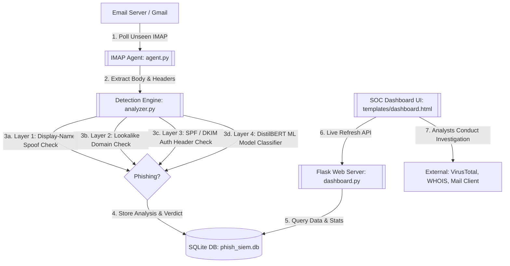

# Phishing SIEM & Automation: Technical Walkthrough

Welcome to the **Phishing SIEM & Automation** platform. This document explains the internal mechanics, architecture, data flows, and configuration of your project.

---

## 1. System Architecture & Data Flow

The project is built as a modular, containerized Security Information and Event Management (SIEM) pipeline designed to ingest emails, analyze them for phishing indicators, record findings in a structured database, and display alert events on an interactive, live-updating dashboard.



---

## 2. Directory and File Structure

Here is a breakdown of the repository files and their roles:

*   **Core Logic:**
    *   [`agent.py`](file:///home/pavanteja/Documents/Phishing-Automation/agent.py): The main background worker that polls the IMAP mailbox, retrieves emails, runs analysis, and saves the output.
    *   [`analyzer.py`](file:///home/pavanteja/Documents/Phishing-Automation/analyzer.py): The multi-layered detection engine that processes each email and issues a verdict.
    *   [`config.py`](file:///home/pavanteja/Documents/Phishing-Automation/config.py): Environment variable parser and central configuration file.
    *   [`db.py`](file:///home/pavanteja/Documents/Phishing-Automation/db.py): SQLite database wrapper containing table schemas and queries.
*   **Web Dashboard:**
    *   [`dashboard.py`](file:///home/pavanteja/Documents/Phishing-Automation/dashboard.py): Flask application serving API endpoints and the dashboard page.
    *   [`templates/dashboard.html`](file:///home/pavanteja/Documents/Phishing-Automation/templates/dashboard.html): The interactive dark-mode dashboard with search, filters, details modal, timeline, and SOC quick-actions.
*   **Testing & Simulators:**
    *   [`mail.py`](file:///home/pavanteja/Documents/Phishing-Automation/mail.py): Developer-focused test suite designed to inject multi-layered mock phishing emails into your inbox.
*   **Knowledge Base & Model Files:**
    *   [`knowledge_base/`](file:///home/pavanteja/Documents/Phishing-Automation/knowledge_base): Contains lists of legitimate/phishing domains and common phishing indicators for reference.
    *   [`Modelfile`](file:///home/pavanteja/Documents/Phishing-Automation/Modelfile) & [`Modelfile.neuralduo`](file:///home/pavanteja/Documents/Phishing-Automation/Modelfile.neuralduo): Configurations to run local GGUF models under Ollama.
    *   [`rag_engine.py`](file:///home/pavanteja/Documents/Phishing-Automation/rag_engine.py): An unused/alternative Retrieval-Augmented Generation (RAG) engine wrapper built with LlamaIndex to query domain files using Ollama embeddings.
*   **Deployment Configuration:**
    *   [`Dockerfile.agent`](file:///home/pavanteja/Documents/Phishing-Automation/Dockerfile.agent): Image definition for the agent, pre-caching the Hugging Face model.
    *   [`Dockerfile.dashboard`](file:///home/pavanteja/Documents/Phishing-Automation/Dockerfile.dashboard): Image definition for the web dashboard.
    *   [`docker-compose.yml`](file:///home/pavanteja/Documents/Phishing-Automation/docker-compose.yml): Infrastructure configuration deploying both components with shared SQLite volumes.

---

## 3. Core Component Walkthrough

### A. IMAP Polling Agent (`agent.py`)
The polling agent is designed to run continuously as a daemon. 
1.  **IMAP Session Initialization**: Connects to the configured mail server (e.g., `imap.gmail.com` on port `993` using SSL) and authenticates using environment variables.
2.  **UNSEEN Email Querying**: Performs an IMAP search for `UNSEEN` messages in the inbox.
3.  **Parsing & Body Extraction**: 
    *   Decodes MIME-encoded headers (Subject, From, Date) into plain-text strings.
    *   Walks multipart messages, prioritizing `text/plain` content.
    *   Falls back to `text/html`, parsing it through a custom HTML stripper (`_strip_html`) that removes `<style>`/`<script>` blocks, hidden divs (e.g., preheaders), tags, and collapses spaces.
    *   Clamps the cleaned body to a maximum of 4,000 characters to prevent overflow and performance bottlenecks.
4.  **Header Extraction**: Extracts relevant routing and authentication headers: `Authentication-Results`, `ARC-Authentication-Results`, `Received-SPF`, and DKIM signatures.
5.  **State Management**: Marks the email as `\Seen` on the server *before* completing the analysis. This ensures that if the container restarts or crashes during a run, it will not get stuck in an infinite processing loop on a corrupted email.
6.  **Persistence**: Invokes the analysis pipeline and records the verdict into the SQLite database.

---

### B. Multi-Layer Phishing Detection Engine (`analyzer.py`)
Each incoming message is processed sequentially through four specialized detection layers. If a layer detects a threat with high confidence, the pipeline returns early with a `PHISHING` verdict.

```
       +---------------------------------------------+
       |             Incoming Email                  |
       +---------------------------------------------+
                              |
                              v
        [Layer 1: Display-Name Spoofing Check]  -->  (Phishing Verdict: 97% Conf)
                              | (Pass)
                              v
        [Layer 2: Typosquat / Lookalike Check]  -->  (Phishing Verdict: 95% Conf)
                              | (Pass)
                              v
        [Layer 3: Cryptographic SPF/DKIM Check] -->  (Pass Both -> Safe: 95% Conf)
                              |                      (Fail Both -> Phishing: 93% Conf)
                              v (Partial / Missing)
        [Layer 4: DistilBERT Deep Learning ML]  -->  (ML Classification Verdict)
```

#### Layer 1: Display-Name Spoofing Check
A common phishing tactic is setting the display name to a trusted brand (e.g., `PayPal Security`) while sending from a random or compromised address (e.g., `alert@spammer-domain.com`).
*   Extracts the display name and actual email domain.
*   Parses the primary brand name (e.g., `paypal`) from the display name, filtering out generic stopwords (e.g., `support`, `bank`, `security`).
*   If a brand name is found but does not match the actual domain name (and is not configured in a known legitimate mapping like `hdfc` to `hdfcbank.com`), it is flagged immediately as **PHISHING** (Confidence: **97%**).
*   If the brand name is embedded with suspicious suffixes (e.g., `paypal-alert-verify.com`), it flags it as a subdomain spoofing attack.

#### Layer 2: Typosquat / Lookalike Domain Check
Checks if the sending domain root is a visual imitation of a known brand.
*   Extracts the root domain.
*   Compares it against a defined array of target brand roots (`_BRAND_ROOTS`) using Python's `SequenceMatcher` algorithm.
*   If the similarity score is $\ge 0.82$ but is *not* an exact match, the system flags it as **PHISHING** due to typosquatting (Confidence: **95%**). E.g., `micr0soft.com` vs `microsoft.com` or `paypa1.com` vs `paypal.com`.

#### Layer 3: Cryptographic Authentication Checks
Analyzes authentication results for the sending domain.
*   Parses SPF and DKIM tags from the mail headers.
*   **Double Pass**: If SPF = Pass and DKIM = Pass, the email is cryptographically verified as authentic and marked **SAFE** (Confidence: **95%**).
*   **Double Fail**: If SPF = Fail and DKIM = Fail, it is flagged as **PHISHING** (Confidence: **93%**).
*   **Partial Result**: If only one check fails (e.g. SPF pass, DKIM fail), it implies possible content tampering or an unauthorized relay. The engine prepends a tag to the body (e.g. `[SPF fail, DKIM pass — unauthorized relay possible]`) and forwards it to the ML classifier.

#### Layer 4: DistilBERT Machine Learning Classifier
If the email passes Layers 1 and 2, and has a partial/unverified cryptographic authentication status, it goes to the ML layer.
*   Uses the PyTorch library to run a DistilBERT sequence classification model (`cybersectony/phishing-email-detection-distilbert_v2.4.1`) cached locally inside the container.
*   Constructs a combined feature representation: `From: <sender> Subject: <subject> Body: <body[:400]>`.
*   Computes classification probabilities across four categories: `legitimate_email`, `phishing_url`, `legitimate_url`, and `phishing_url_alt`.
*   Groups threat scores (`phishing_url` + `phishing_url_alt`) and safety scores (`legitimate_email` + `legitimate_url`). The highest aggregate value determines the final verdict (**PHISHING** or **SAFE**).

#### Keyword Threat Signals
`analyzer.py` maps common phishing vocabulary into four categories:
1.  **Urgency & Pressure**: `verify`, `confirm`, `urgent`, `act now`, `suspended`, `within 24 hours`.
2.  **Sensitive Information / Credentials**: `password`, `login`, `cvv`, `otp`, `bank details`.
3.  **Financial Lures**: `refund`, `payment failed`, `invoice`, `wire transfer`, `cashback`.
4.  **Lookalike keywords**: `-secure`, `verify-`, `account-update`, `login-`.
If the final verdict is phishing, the engine appends these matches to describe *why* the message was flagged.

---

### C. Database Layer (`db.py`)
A SQLite database acts as the single source of truth. The database is stored at `phish_siem.db` (or inside `/data` in Docker environments).

#### Schema: `emails` Table
| Column | Type | Description |
| :--- | :--- | :--- |
| `id` | `INTEGER` | Primary Key (Auto-Increment) |
| `sender` | `TEXT` | Full decoded sender header (e.g., `Brand <noreply@domain.com>`) |
| `subject` | `TEXT` | Subject header line |
| `body` | `TEXT` | Extracted and sanitized plain-text body (max 4000 characters) |
| `verdict` | `TEXT` | Engine verdict: `PHISHING`, `SAFE`, or `UNKNOWN` |
| `confidence`| `REAL` | Value between `0.0` and `1.0` representing detection confidence |
| `reason` | `TEXT` | Detailed reason detailing spoofing, SPF/DKIM flags, or ML labels |
| `received_at`| `TEXT` | Original timestamp when the email was sent/received |
| `analyzed_at`| `TEXT` | ISO-8601 UTC timestamp when the SIEM pipeline processed the email |

---

### D. Flask Web Server & Dashboard (`dashboard.py` / `dashboard.html`)
The dashboard is a real-time SOC interface for security analysts.

#### API Endpoints
*   `GET /`: Serves the HTML UI dashboard.
*   `GET /api/emails`: Returns all analyzed email records in JSON format (ordered by `analyzed_at` descending).
*   `GET /api/stats`: Returns dynamic aggregates: total emails, phishing count, safe count, and the last checked timestamp.

#### SOC Analyst Features
1.  **Live Polling**: A frontend script queries `/api/stats` and `/api/emails` every **15 seconds** to refresh dashboard figures and inject newly detected emails without reloading.
2.  **Search & Filters**: Allows immediate filtering by keyword (sender, subject, reason) and quick filtering by verdict (`All`, `Phishing`, `Safe`, `Unknown`).
3.  **Risk Severity Mapping**: Phishing emails are dynamically categorized into risk tiers:
    *   **Critical** (Confidence $\ge 95\%$)
    *   **High** (Confidence $\ge 85\%$)
    *   **Medium** (Confidence $\ge 70\%$)
    *   **Low** (Confidence $< 70\%$)
4.  **Investigation Tabs**:
    *   *Overview*: Displays sender metadata, detection confidence, and detection layer details.
    *   *IOCs*: Lists sender details and **extracts all URLs** contained in the body.
    *   *Headers / Auth*: Visual representation of SPF, DKIM, and DMARC passes or failures.
    *   *Email Body*: Displays sanitized email content in a scrollable terminal container.
    *   *Timeline*: Renders the lifecycle of the email, from reception to database entry.
5.  **SOAR Quick Actions**:
    *   **Investigate**: Opens external tabs on VirusTotal, WHOIS, and MXToolbox for the sender domain.
    *   **Report Abuse**: Automatically formats and opens an abuse report email directed to the sender's host registrar (e.g. `abuse@domain.com`).
    *   **Copy IOCs**: Copies a structured IOC Markdown report to the analyst's clipboard.
    *   **Send Alert**: Drafts a warning email containing the classification data.
    *   **Mark Reviewed**: Flags an incident as processed (toggles row opacity and saves state via local storage).

---

### E. Simulated Test Suite (`mail.py`)
To validate the detection layers, `mail.py` sends a series of mock emails to the configured mailbox.
It contains predefined test cases matching:
*   *PayPal / DHL / Microsoft spoofing display names* (Layer 1 test cases).
*   *Typosquat domains like `amaz0n-orders.com` and `g00gle-account.com`* (Layer 2 test cases).
*   *Financial and credential lures from unauthenticated sources* (Layer 4 test cases).
*   *Legitimate order confirmations and newsletters* (Safe test cases).

---

## 4. Containerization & Deployment

The application is fully containerized and controlled via `docker-compose.yml`.

### Docker Architecture
*   **Shared Volume (`sqlite_data`)**: Mounted to `/data` in both containers. This shares the SQLite database `phish_siem.db` and the persistent Chroma DB collection, ensuring that write actions by the **agent** are immediately visible on the **dashboard** API.
*   **Model Pre-Caching Optimization**: 
    In `Dockerfile.agent`, a dummy python execution downloads the `distilbert` tokenizer and classification weights during the **Docker build phase**:
    ```dockerfile
    RUN python -c "\
    from transformers import AutoTokenizer, AutoModelForSequenceClassification; \
    AutoTokenizer.from_pretrained('cybersectony/phishing-email-detection-distilbert_v2.4.1'); \
    AutoModelForSequenceClassification.from_pretrained('cybersectony/phishing-email-detection-distilbert_v2.4.1');"
    ```
    This removes the download latency at container boot, ensuring the SIEM goes live immediately.
*   **Network Mode**: Configured as `network_mode: host` to allow easy local inter-process connection and SMTP/IMAP network access.

---

## 5. Summary of Environment Variables (`.env`)

Configure the following parameters in your local `.env` file to customize operations:

```ini
# IMAP Mailbox Settings
IMAP_HOST=imap.gmail.com
IMAP_PORT=993
IMAP_USER=your-email@gmail.com
IMAP_PASS=your-gmail-app-password

# SIEM Tuning
POLL_INTERVAL=30
DB_PATH=./phish_siem.db
ML_MODEL_NAME=cybersectony/phishing-email-detection-distilbert_v2.4.1
```

---

## 6. Machine Learning & Language Models Used

The project contains files supporting two distinct machine learning and language model setups:

### A. Production Phishing Classifier (Hugging Face / PyTorch)
*   **Model ID**: `cybersectony/phishing-email-detection-distilbert_v2.4.1`
*   **Type**: DistilBERT sequence classification model fine-tuned for email phishing detection.
*   **Role**: Used by `analyzer.py` (Layer 4) to verify email texts. It takes the sender, subject, and body, and returns prediction probabilities across four target categories.
*   **Optimization**: Cached in the Docker agent image during build time, so no runtime download is required.

### B. Local Large Language Model & RAG Setup (Ollama / LlamaIndex)
Your workspace also contains files for local offline inference using GGUF-format quantized models:
*   **Local GGUF Model**: `neuralduo-phishing.gguf` (located in the workspace root).
*   **Ollama Custom Models**:
    *   `Modelfile.neuralduo`: Configures Ollama to load the local `neuralduo-phishing.gguf` model with customized inference configurations (temperature=0, top_p=0.9).
    *   `Modelfile`: Configures Ollama to create a model from `/home/pavanteja/Downloads/phish-gemma-v2.gguf`.
*   **RAG Engine (`rag_engine.py`)**:
    *   Combines **LlamaIndex** with **Ollama** embeddings (`nomic-embed-text`) and a custom model (`phish-gemma`).
    *   Indexes custom local threat intelligence databases (`knowledge_base/phishing_domains.txt`, `knowledge_base/legitimate_domains.txt`, `knowledge_base/phishing_patterns.txt`) into a persistent vector store client (**ChromaDB**).

